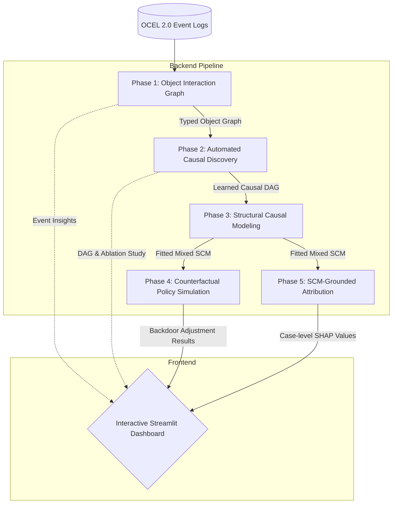

# CausalOCPM
**Causal-Explainable Object-Centric Process Mining**

  

**🌐 Live Dashboard:** [https://causalocpm-etpavgjhzcyfdhufeftyrz.streamlit.app/](https://causalocpm-etpavgjhzcyfdhufeftyrz.streamlit.app/)

CausalOCPM is an end-to-end analytical framework that bridges **Object-Centric Process Mining (OCPM)** and **Structural Causal Models (SCM)**. It enables rigorous, counterfactual policy evaluation in complex, multi-entity business processes.

---

## The Problem: The Confounding Trap

Traditional process mining relies on correlation. But in complex systems, correlations are often systematically inflated by unmeasured confounders.

Imagine a manufacturing scenario:
> *Complex orders preferentially use Supplier-A AND have inherently longer lead times.* 

Naive analysis overstates Supplier-A's causal contribution to delays by ~20%. **CausalOCPM** automatically identifies these confounders via causal discovery, removes their influence via backdoor adjustment, and recovers the *true* causal effect.

---

## Key Features

- **End-to-End Pipeline**: From OCEL 2.0 event logs to actionable causal insights, utilizing **pm4py** for process mining.
- **Automated Causal Discovery**: Uses the PC Algorithm (Fisher's Z) with domain knowledge constraints to discover causal DAGs.
- **Structural Causal Modeling**: Fits mixed SCMs (Logistic, Linear, Gradient Boosting) without global linearity assumptions.
- **Counterfactual Policy Simulation**: Double Machine Learning (DML) with DoWhy-powered backdoor adjustment, CATE analysis, E-value computations, and 10-seed robustness testing.
- **SCM-Grounded Attribution**: Understand case-level root causes using advanced SHAP techniques applied directly to structural equations.
- **Cerebras-Powered Decision Intelligence Copilot**: An integrated LLM agent (**Gemma 4 31B** via Cerebras) with a full offline fallback system that translates complex causal math into instant, board-ready executive summaries.
- **Interactive Streamlit Dashboard**: A 5-tab UI featuring an interactive what-if causal simulator, AI copilot, and case attribution.

---

## Architecture Design

CausalOCPM is organized into a linear 5-phase backend pipeline that feeds directly into an interactive frontend dashboard. 



---

## Datasets & Validation Methodology

CausalOCPM is rigorously validated using two highly realistic synthetic event logs (15,000 rows each) with planted causal structures. The datasets feature outliers (~2%), irregular business-hour timestamps, concept drift, and seasonal effects.

1. **Manufacturing (`prihir_synthetic.csv`)**: Models an order-to-shipment pipeline where order complexity confounds supplier choice and delay. Naive correlation overestimates delays by ~19%.
2. **Healthcare (`hospital_synthetic.csv`)**: Models patient admissions where patient complexity confounds specialist assignment and length of stay. Naive correlation overestimates delays by ~15.5%.

Through the `validate.py` automated testing module, the framework consistently verifies:
- **DAG Discovery F1 Score**: 1.000 for both domains.
- **Causal Estimate Stability**: DML estimates land within 0.4 days of ground truth, robustly across 10 random seeds.

---

## Quick Start

### 1. Installation

Clone the repository and install dependencies:
```bash
git clone https://github.com/Mounil2005/CausalOCPM.git
cd CAUSALOCPM
pip install -r causal_ocpm/requirements.txt
```
*(Note: `causal-learn` is pip-installed as `causal-learn` but imported as `causallearn`.)*

### 2. Generate Data & Run Pipeline

Generate synthetic data with planted ground truth for validation:
```bash
# Manufacturing domain
python causal_ocpm/data/generate_data.py

# Healthcare domain
python causal_ocpm/data/generate_healthcare.py
```

Process the data through the 5-phase pipeline:
```bash
python causal_ocpm/src/phase1_graph.py
python causal_ocpm/src/phase2_discovery.py
python causal_ocpm/src/phase3_scm.py
python causal_ocpm/src/phase4_dooperator.py
python causal_ocpm/src/phase5_attribution.py
```

Validate pipeline integrity and model accuracy:
```bash
pytest -v causal_ocpm/tests/test_pipeline.py
python causal_ocpm/validate.py
```

### 3. Launch the Dashboard

```bash
streamlit run causal_ocpm/app/dashboard.py
```

---

## The Dashboard Experience

The interactive dashboard is built using Streamlit and features 5 distinct visualizations grouped into 5 specialized experiences:

1. **Overview**: Executive summary — headline causal finding, expected savings, and top recommended interventions.
2. **Data & Discovery**: Event log summaries, object-type interaction graphs, learned causal DAG, and a domain-knowledge ablation study.
3. **Model & Impact**: An **Interactive What-If Causal Simulator**, SCM summary, treatment-effect heterogeneity (CATE), and SCM-grounded SHAP waterfall attribution.
4. **Decision Intelligence**: A boardroom-style executive report.
5. **Causal Copilot**: A Cerebras-powered conversational agent (Gemma 4 31B) for answering free-text questions grounded in live pipeline output, backed by an offline fallback system.

---

## Novelty & Impact

While tools like **PM4Py** excel at descriptive process analytics and **DoWhy/CausalNex** handle effect estimation, *no public tool integrates them.* 

**CausalOCPM is the first unified application to combine object-centric event logs, automated causal discovery, SCM fitting, interactive counterfactual policy simulation, and a real-time LLM Copilot** — all rigorously validated against planted ground truth across multiple domains.

---

## References

- Pearl, J. (2009). *Causality: Models, Reasoning and Inference*
- van der Aalst, W.M.P. et al. (2022). *Object-Centric Process Mining*
- Sharma, A., Kiciman, E. (2020). *DoWhy: An End-to-End Library for Causal Inference*
- Zheng, Y. et al. (2023). *causal-learn: Causal Discovery in Python*
- Heskes, T. et al. (2020). *Causal Shapley Values*
